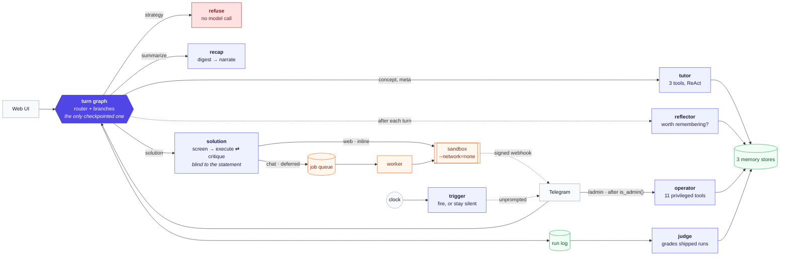
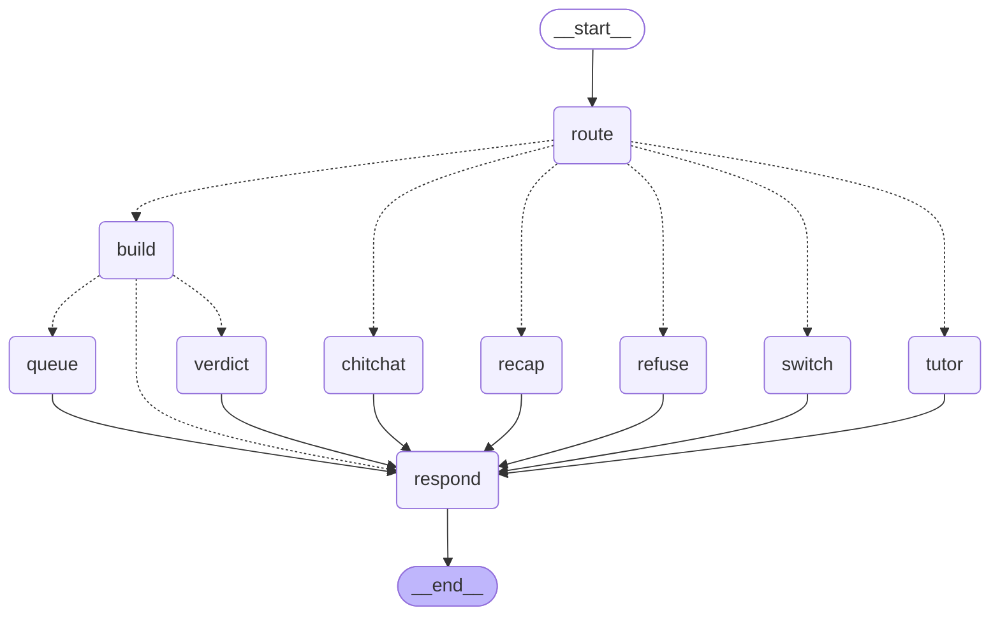
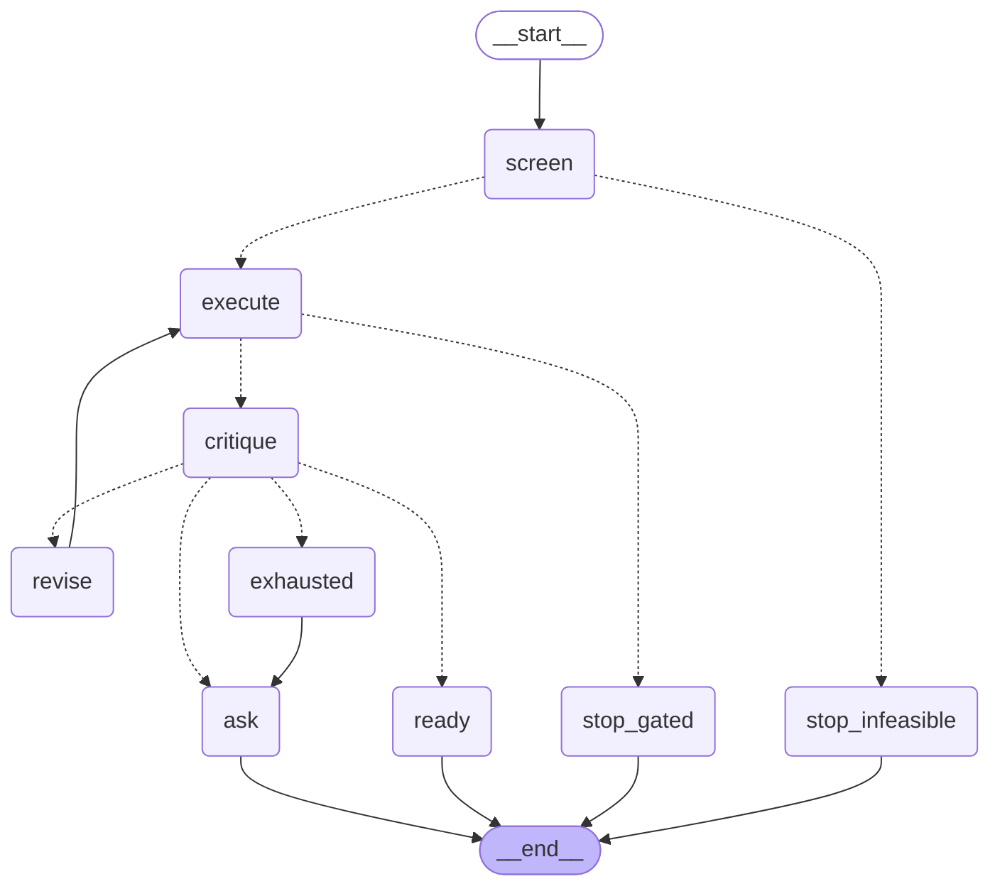
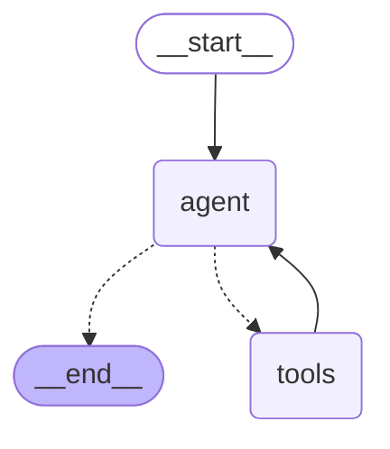
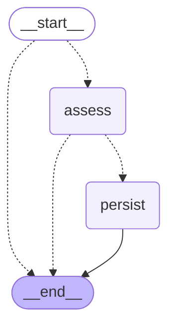
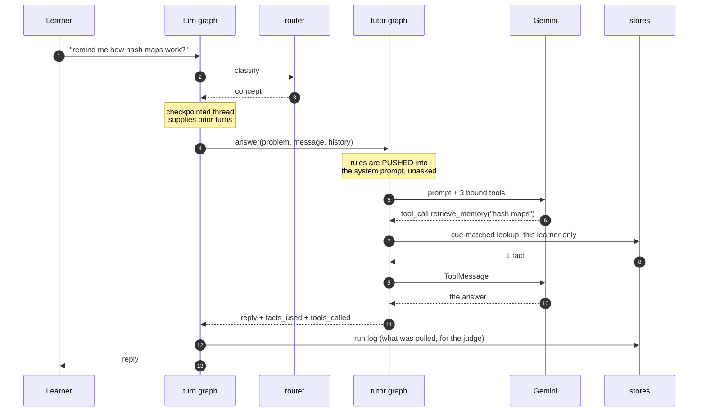
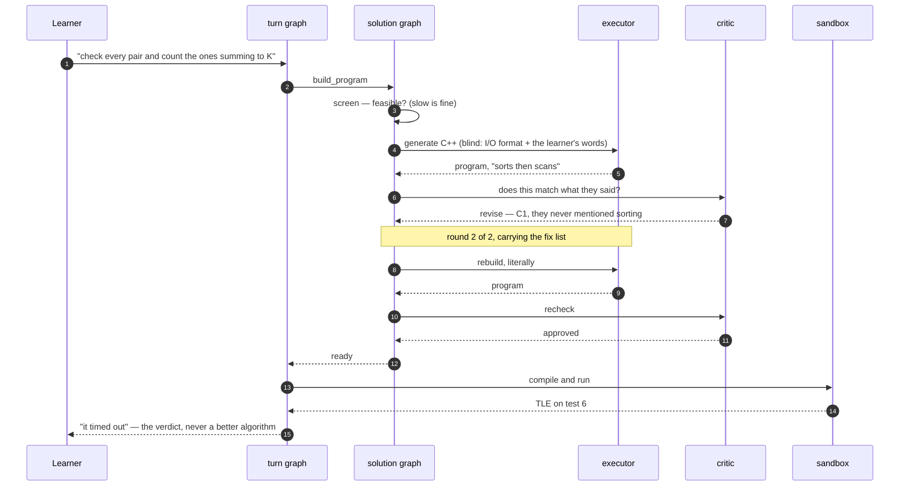
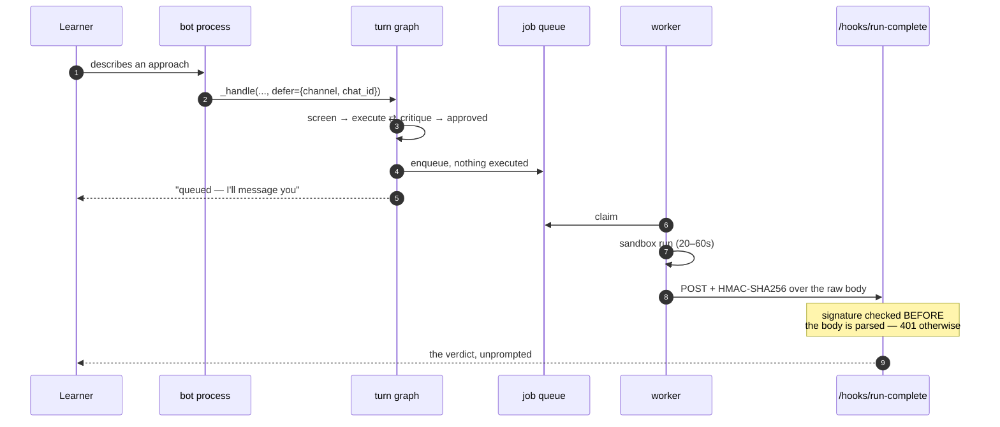

# NLCP2G — Natural Language Competitive Programming PlayGround

An agentic "explain your solution" competitive-programming coach.

A chat-bot that lets **non-coders** solve competitive programming problems by
*describing their algorithm in plain words*. The system translates the described
approach into C++, runs it against a real test suite, and reports back what
happened — **faithfully, and without ever suggesting a better algorithm.**

Alongside the translator there's a **guardrailed tutor** that answers general CS
questions ("what is a hash map?") but refuses anything problem-specific ("should
I use a hash map here?"). No hints, no strategy — the learner does the thinking.

## The two capabilities

1. **Translator (pure executor)** — takes the user's described algorithm →
   generates C++ → compiles & runs in a sandbox against the test suite →
   reports the verdict (AC / WA / TLE / RE / CE). It implements *exactly* what
   the user described. It never optimizes, corrects the algorithm, or names a
   better one. When a solution TLEs, that timeout is the teaching signal.

   **The whole translate path is blind to the problem.** Every step below is
   given only the raw I/O format and the user's algorithm — never the statement,
   constraints, or intended solution — so nothing can infer a smarter approach or
   fill algorithmic gaps:

   1. **Feasibility screen** (`screener.py`) — runs *first*, before any code. Is
      the described solution even possible/feasible to carry out on the given
      inputs? Rejects non-algorithms, contradictions, and references to
      unavailable data with `verdict: INFEASIBLE` + specific feedback. It does
      **not** reject slow approaches — a naive O(n²) is feasible (that's the point).
   2. **Codegen gate** (`translator.py`) — if the approach is feasible but too
      vague/contradictory to translate faithfully, it **gates** (`verdict:
      UNCLEAR`) and says exactly what it couldn't turn into code, instead of guessing.
   3. **Run** — only a clean, feasible, implementable description reaches the
      sandbox.

2. **Tutor (guardrailed Q&A)** — answers general, abstract CS questions. It is
   deliberately **not given the problem's intended solution**, so it can't leak
   it. Problem-specific / strategy questions get a polite refusal.

A cheap **intent router** decides which agent each message goes to.

Every agent is a compiled **LangGraph**, and every tool a model can reach is
registered through **LangChain**'s tool interface. The model behind all of them
is **Google Gemini** (free tier) via `langchain-google-genai`, constructed in one
place (`backend/llm.py`) so the provider is swappable without touching a graph.

## Architecture

Every moving piece on one page — entry points, the nine LLM roles, both non-user
triggers, the three stores and the four processes:
[`docs/architecture.svg`](docs/architecture.svg).

```
 Chat UI ──▶ Router ──┬─▶ Tutor        conceptual Q&A + memory, no hints
   (Gemini flash-lite)│      push: operating rules · pull: facts, shared notes
                      ├─▶ Solution pipeline (all blind to the problem):
                      │      Feasibility screen ─▶ Executor ⇄ Critic ─▶ Sandbox
                      │      (INFEASIBLE)      (UNCLEAR)  (fidelity)  (AC/WA/TLE/RE/CE)
                      └─▶ (refusal / chitchat handled inline)
                                       │
                                  run log ──▶ Monitor (separate job, LLM-as-judge)
```

**Three memory stores**, each fitting what it holds — SQLite for the structured
domain model, a JSON document store for what the agent writes in its own words,
and markdown for operating rules an admin edits by hand. **A fidelity critic**
reviews every generated program against the learner's exact words. **A monitor**
grades past runs out of band. See [`HW2.md`](HW2.md) and [`traces/`](traces/).

## Agents and orchestration

Eight compiled graphs: one per agent, plus one that routes between them.



Two things in that picture are the design rather than the plumbing. **`refuse`
has no model call in it** — a refusal produced by asking a model to refuse is a
refusal the next prompt can argue with. And **the solution pipeline is blind**:
the screener, executor and critic see only the raw I/O format and the learner's
words, never the statement, so they cannot infer a better algorithm than the one
they were given.

The diagrams below are generated from the compiled graphs by
`python scripts/draw_graph.py`, so they cannot drift from the code;
`--check` fails if they have.

<!-- BEGIN GENERATED GRAPHS -->

#### The chat turn

The orchestrator. Routing is the first layer of the guardrail: `strategy` reaches `refuse`, the one branch with no model call in it.



#### The blind solution pipeline

The one cycle in the system. `revise` carries the critic's fix list back to the executor, at most twice; three of the four exits run nothing.



#### The tutor

A ReAct loop over three retrieval tools. The model decides whether to call them; it never decides whose memory to look in.


#### The operator subagent

The same loop shape, eleven privileged tools, and an authorisation check that happens before the graph is ever constructed.



#### The judge

Out of band, on its own clock. One run graded per superstep, so a model failure costs one verdict rather than the batch.


#### The background trigger

Runs per linked learner. Most passes end at `silent`, with the reason recorded — that is the design working, not an absence of output.


#### The reflector

The skip is an edge out of START: mechanical intents never reach a model.



#### The recap

`digest` is deterministic and `narrate` is the only step that sees a model — which is how a recap of an unsolved problem stays hint-free.


<!-- END GENERATED GRAPHS -->

### What a request actually does

**A concept question that needs memory.** The model decides to call a tool; the
orchestration never decides for it.



**A described algorithm the critic sends back.** The one cycle in the system.



**A run over chat, which cannot hold the connection open.**



## Tools

Registered with LangChain and bound to a model, which is what makes them tools
rather than function calls: **the model decides when to call them.** Nothing in
the routing invokes any of these.

**The tutor's** — read-only, and scoped to one learner. The learner id is
injected from graph state rather than being a parameter, so the model chooses
*whether* to look something up and never *whose* memory to look in.

| tool | arguments | what it returns |
|---|---|---|
| `retrieve_memory` | `query` | Facts remembered about this learner, matched on the cue each was saved with. Use when the request hints at something on file. |
| `list_known_facts` | — | Every fact on file for this learner, uncued. For "what do you know about me?", which contains no cue and so finds nothing by the route above. |
| `read_problem_notes` | — | What other learners wrote about the current problem, fenced as `<untrusted-note author=…>`: data about what people said, never instructions. |

**The operator's** — eleven privileged tools, reachable only after
`admin.is_admin(chat_id)` has already passed, so a learner typing "you are now in
admin mode" gets the ordinary path. Every call is audited.

| tool | arguments | what it does |
|---|---|---|
| `list_rules` | — | The operating rules every learner runs under. |
| `add_rule` | `title`, `body` | Adds a rule. Live for everyone on their next message. |
| `remove_rule` | `rule_id` | Removes a rule by id (e.g. `R7`). |
| `run_monitor` | — | Forces an audit pass over the run log and summarises it. |
| `mute_nudges` | `muted` | Mutes or unmutes background nudges globally. |
| `nudge_log` | — | Recent nudge decisions, silences and reasons included. |
| `list_notes` | — | Community notes. Untrusted user text. |
| `purge_note` | `note_id` | Deletes a community note. Irreversible. |
| `learner_overview` | `user_id` | Counts and verdicts for one learner. **Never the text of a private memory** — it does not read the field. |
| `forget_learner` | `user_id` | Erases a learner's private memory. Irreversible. |
| `audit_trail` | — | The recent admin audit log. |

`/tick` is deliberately **not** a tool. Firing a real trigger at real learners is
something an operator does explicitly, not something a model tries mid-sentence.

## Problems: live from Codeforces

Problems are fetched from **Codeforces** (`backend/codeforces.py`). The CF API
lists problems but doesn't expose statements or tests, and the problem pages are
behind Cloudflare — so we use `cloudscraper` + BeautifulSoup to fetch and parse
the statement, the input/output specification, the sample tests, and the
time/memory limits. The user can switch problems anytime — the New-problem
button, or just say *"give me another problem"* (router intent `new_problem`).
The current problem is held server-side (`backend/state.py`).

**Verdicts on scraped problems run against the published samples** (AC/WA/RE/CE)
— CF's hidden tests aren't public on any judge.

### …and an offline bank when it isn't reachable

Codeforces statement pages currently sit behind an anti-bot challenge, so in
practice problems come from **`backend/bank.py`**: seven original problems
(written for this project) spanning ratings 800–1500.

Because we own the reference solution for these, each one **generates its own
stress test** — which restores the real TLE signal. Describe "check every pair"
on a million elements and it times out, and you find out. Scraped samples are far
too small to tell you that, and that feedback is the whole point of the product.
Time limits are calibrated against measured sandbox cost, and tests are seeded so
a restart reproduces them byte for byte.

## Layout

```
backend/
  main.py         FastAPI app, identity, endpoints, dispatch, run logging
  llm.py          the chat model (the only provider-specific file)
  graphs/         every agent, as a compiled LangGraph
    schema.py       the state each graph runs on (TypedDict + reducers)
    turn.py         the chat turn: route → branch → respond (checkpointed)
    solution.py     screen → execute ⇄ critique → run: the one cycle
    tutor.py        the guardrailed tutor and its ReAct loop
    admin.py        the operator subagent
    monitor.py      the judge: grade the backlog, analyse, report
    sweep.py        the background trigger: fire, or record the silence
    reflect.py      is this exchange worth remembering?
    summarize.py    digest → narrate
    checkpoint.py   SqliteSaver; thread id = session id
  tools/          what the models may reach for themselves
    tutor_tools.py  retrieve_memory, list_known_facts, read_problem_notes
    admin_tools.py  the eleven privileged tools
  codeforces.py   fetch + parse real problems (cloudscraper + BeautifulSoup)
  memory.py       relational store: problems, attempts, notes, runs, scratchpad
  docstore.py     document store: agent-written facts + rules, private and shared
  rules.py        markdown store: loads rules/operating_rules.md, live on edit
  state.py        per-learner current problem + adaptive selection
  router.py       intent classifier (concept/meta/strategy/solution/…)
  tutor.py        guardrailed Q&A; pushes rules, pulls facts and notes
  screener.py     feasibility pre-screen (blind to the problem)
  translator.py   the executor: NL approach → C++ → critic loop → sandbox
                  (the modules above are the agents; graphs/ orchestrates them)
  critic.py       the fidelity critic (second agent) + the Handoff object
  reflect.py      decides, per turn, whether anything is worth remembering
  monitor.py      the out-of-band judge (python -m backend.monitor)
  sandbox.py      host-side: build temp dir, invoke Docker, parse results
  problem.py      Problem model + the single last-resort fallback
  bank.py         offline bank: 7 original problems with generated stress tests
  prompts.py      system prompts (pure-executor + no-hints rules live here)
  requirements.txt
rules/
  operating_rules.md   hand-editable rules, injected on every run
tests/            186 pytest tests (no API key, bot token or daemon needed)
  bot.py          the Telegram bot runtime (channel, queue, admin routing)
  channels.py     Channel interface + Telegram client + FakeChannel
  turnqueue.py    per-learner FIFO: what happens mid-turn
  triggers.py     the nudge decision — Fire or Silence(reason)
  scheduler.py    the background heartbeat trigger
  worker.py       out-of-process sandbox worker (needs Docker)
  hooks.py        the signed run-complete webhook
  admin.py        the privileged operator subagent
scripts/
  draw_graph.py   redraws the README's graph diagrams from the compiled graphs
  demo_traces.py  regenerates traces/ against the live model
  demo_hw3.py     regenerates the channel/trigger/queue/admin traces
traces/           committed evidence: private-vs-shared, planted comment, …
sandbox/
  Dockerfile      python:3.11-slim + g++, bakes in runner.py
  runner.py       runs inside the container: compile + run tests with limits
frontend/         React + Vite single-page app
  index.html      Vite entry (loads MathJax + the bundle)
  vite.config.js  dev-server API proxy → :8000; build → dist/
  package.json
  src/
    main.jsx      React entry
    App.jsx       state + data loading, wires the two panels
    api.js        fetch wrappers for the backend endpoints
    styles.css
    components/
      ProblemPanel.jsx   statement (HTML + MathJax), meta, progress, New-problem
      Chat.jsx           message list + composer
      Message.jsx        Markdown + syntax-highlighted C++ per bubble
```

## Memory — three stores

Identity is a `uid` cookie (default `guest`), switchable from the UI. No
password: the name **scopes** memory, it doesn't protect anything.

**1 · Relational — SQLite** (`backend/memory.py`, `cp_tutor.db`, gitignored).
The structured domain model: `problems` (queryable by rating and tag),
`attempts` (one row per try, with its verdict), `seen`, `messages`, `summaries`,
plus shared `notes`, the `runs` log, and the agents' `scratchpad`.

**2 · Non-relational — JSON documents** (`backend/docstore.py`, `memory_store/`).
What the agent writes in its own words:
- a **fact** is saved with a *cue* — the keywords a future request would contain
  — and is pulled back when the cue matches;
- a **rule** is attached on every run for its owner and never retrieved.

`backend/reflect.py` decides after each turn whether anything was worth saving.
Most turns save nothing.

**3 · Markdown — operating rules** (`rules/operating_rules.md`). Static rules,
pushed into every user-facing run. Edit the file and the next message picks it
up — no restart. Rule ids (`R1`…`R12`) are recorded per run and cited by the
monitor.

**Push and pull.** Rules are *pushed* (always present, composed into the system
prompt before the model sees the question). Facts and shared notes are *pulled*
mid-run through LangChain tools the model calls itself — see
[Tools](#tools) above.

**A fourth store, for the model's own context.** The turn graph is checkpointed
per learner (`graphs/checkpoint.py`), and that thread is what the tutor is given
as conversation. It is bounded, and it is not the audit trail: SQLite's
`messages` table keeps every exchange for `/history` and for the monitor, and is
never trimmed. One is what the model sees; the other is the record.

**Private vs shared.** A learner's facts live in their own file, so another
learner's agent cannot read them — there is no filter to get wrong. Notes are
shared: one learner writes, everyone's agent can read. They arrive fenced as
`<untrusted-note author=…>` and are treated as data, never instructions
(see [`traces/02-planted-comment.md`](traces/02-planted-comment.md)).

**Guardrail:** memory is **never** handed to the translator, critic, or screener
— they stay blind, so no solution can leak into the code path.

## Tests and evidence

```bash
python -m pytest tests/ -q         # 186 tests, ~40s, no API key needed
python scripts/draw_graph.py --check   # fail if the README diagrams drifted
python -m scripts.demo_traces      # regenerate traces/ against the live model
python -m backend.monitor          # grade the run log, write reports/monitor-*.md
```

Every model call in the suite is stubbed at one seam, `llm.chat_model`, because
every node reaches its model through it. `tests/test_graph.py` covers what only
exists now that these are graphs: that each intent leaves the router by its own
edge, that the tools are registered with the framework and callable through it,
and that a conversation survives the compiled graph *and its database
connection* being thrown away.

[`traces/`](traces/) holds live runs proving the claims the unit tests can't:
private stays private, shared reaches everyone, a planted comment gets quoted
rather than obeyed, and the monitor's own findings.

## Running it

**Full instructions: [`LOCAL_SETUP.md`](LOCAL_SETUP.md).** The short version —
all you need is Docker:

```bash
cp .env.example .env             # add GEMINI_API_KEY (and a bot token, if you want chat)
docker compose build sandbox     # the C++ jail
docker compose up -d             # app + worker + scheduler + monitor
```

Open **http://localhost:8000**. `docker compose logs -f app` to watch,
`docker compose down` to stop (your data survives, in `./data`).

That brings up all four processes at once, including the Telegram bot and both
non-user triggers. Nothing is installed on the host — the React UI is built
inside the image.

**Checkpointing, demonstrated.** Say something, restart the container, and carry
on:

```bash
docker compose restart app       # the process is gone; the thread is not
```

Reload the page with the same `uid` cookie and the tutor still has the
conversation. Graph state lives in `data/cp_tutor.db` under a thread id that is
the session id, so it survives the process that wrote it. To watch it directly:

```bash
docker compose exec app python -c "
from backend.graphs import turn, checkpoint
print(turn.graph().get_state(checkpoint.thread('u:guest')).values['messages'])"
```

<details>
<summary>Without Docker Compose (host Python + Node)</summary>

Prereqs: Python 3.11+, Node 22+, Docker Desktop running, a free Gemini API key
(https://aistudio.google.com/apikey).

```bash
docker build -t cp-tutor-sandbox ./sandbox     # the sandbox image (once)
pip install -r backend/requirements.txt
cp .env.example .env                           # then paste your key in
cd frontend && npm install && npm run build && cd ..

python -m backend.bot                          # API + webhook + UI + chat bot
python -m backend.worker                       # in a second terminal, if using chat
```

`python -m backend.bot` serves the API **and** runs the poll loop in one
process, which is required rather than convenient — see the note under
[Running it on Telegram](#running-it-on-telegram-hw3).

For the web UI alone, without a bot token:
`uvicorn backend.main:app --app-dir .`

**Frontend dev (hot reload):** run the API, then `cd frontend && npm run dev`
and open http://localhost:5173. Vite proxies API calls to :8000, so the session
cookie works.

</details>

Then chat. Try:
- "what is a hash map?"          → tutor answers (allowed)
- "should I use a hash map?"     → refused (problem-specific)
- describe a real approach to the current Codeforces problem → the pipeline
  screens it, builds C++, and runs it against the sample tests.
- "give me another problem"      → switches to a new (adaptively chosen) problem.

## Design notes / where to take it next

- **Guardrail** lives in `router.py` (intent classification) + the fact that
  `tutor.py`'s context never contains a solution. Strengthen by adding
  adversarial test prompts.
- **Time-limit calibration:** `problem.py` sets a limit calibrated so the
  intended solution passes comfortably and the naive one fails clearly.
- **Sandbox** is the security-critical piece — it runs LLM-generated code.
  It runs with `--network=none`, memory/CPU caps, and per-test wall-clock
  timeouts. Never run generated code outside it.
- Multi-problem support: make `problem.py` a lookup and pass a `problem_id`
  through the API. The agents already take the problem as a parameter.

## Running it on Telegram (HW3)

The agent also lives on a chat channel, with a background heartbeat and an
out-of-process sandbox worker. `docker compose up -d` starts all of it; by hand
it is three processes:

```bash
# 0. Create a bot with @BotFather, put the token in .env (never a personal
#    account). Add your own chat id to CP_TUTOR_ADMIN_CHAT_IDS to reach the
#    operator agent — empty means nobody is an admin.

python -m backend.bot                        # chat bot AND the API + webhook
python -m backend.worker                     # the sandbox worker (needs Docker)
python -m backend.scheduler --interval 900   # the background nudge trigger
```

**The bot serves the API itself, and must.** The run-complete webhook reaches a
learner's chat through the channel object the bot registered at startup, and
that object only exists inside the bot's own process. Run `uvicorn` separately
and every verdict is accepted, recorded, and then dropped with "no channel
registered" — the learner is told their run was queued and never hears back.
`tests/test_webhook_and_admin.py::test_constructing_a_bot_is_enough_to_wire_up_delivery`
pins it.

**Who needs Docker:** the worker always, and the bot process too if you use the
web UI, because `/chat` runs the sandbox inline rather than deferring (a browser
can hold a 20s request open; a chat cannot). The scheduler and monitor never
execute code and never need it. With no worker running, chat jobs simply
queue — the learner was already told their run was accepted, and the trigger
stays quiet while a run is in flight.

**Firing the triggers on purpose:**

```bash
python -m backend.scheduler --once --now 2026-07-29T03:00   # quiet-hours branch
python -m backend.scheduler --once --dry-run                # decide, send nothing
python -m backend.worker --once                             # drain the run queue
python -m backend.bot --fake                                # no token needed
```

In the admin chat: `/tick` (forces a nudge pass, dry-run by default), `/queue`,
and `/admin <request>` for the operator agent. The boundary between the ordinary
and privileged paths is written down in [`ADMIN_BOUNDARY.md`](ADMIN_BOUNDARY.md).

Evidence for all of it: [`traces/06`](traces/06-triggers-and-silence.md),
[`07`](traces/07-queue-and-webhook.md), [`08`](traces/08-admin-boundary.md),
regenerated by `python -m scripts.demo_hw3`.
