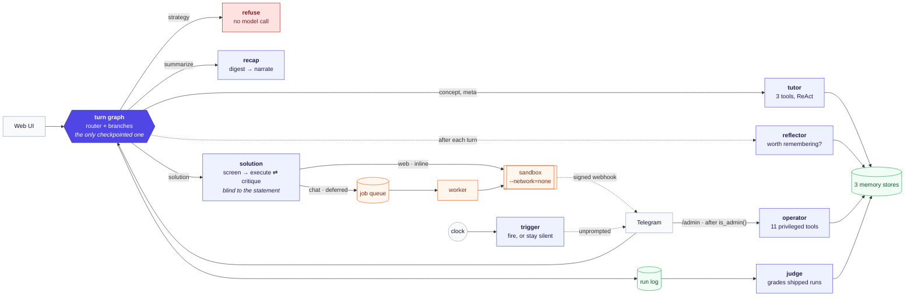
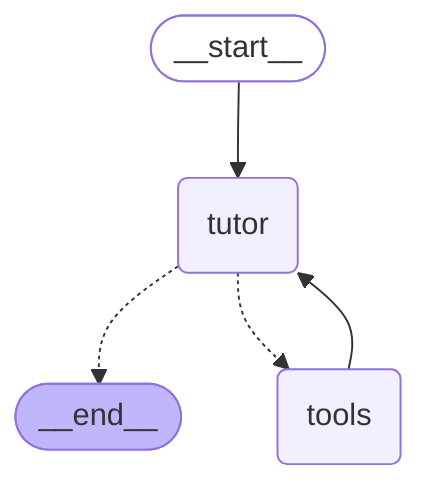
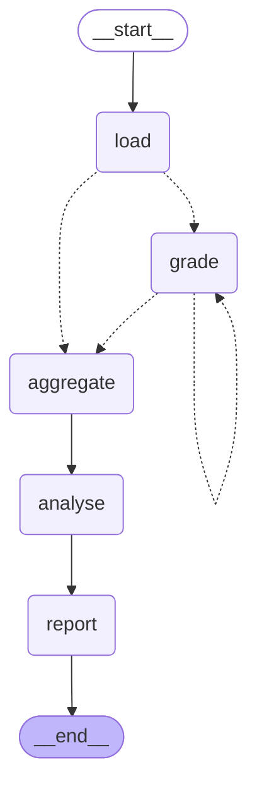
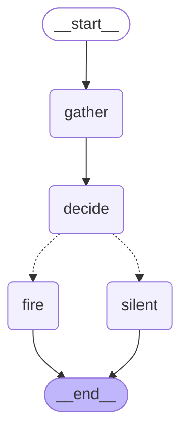
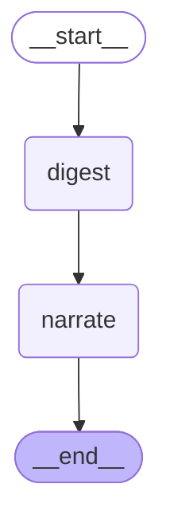
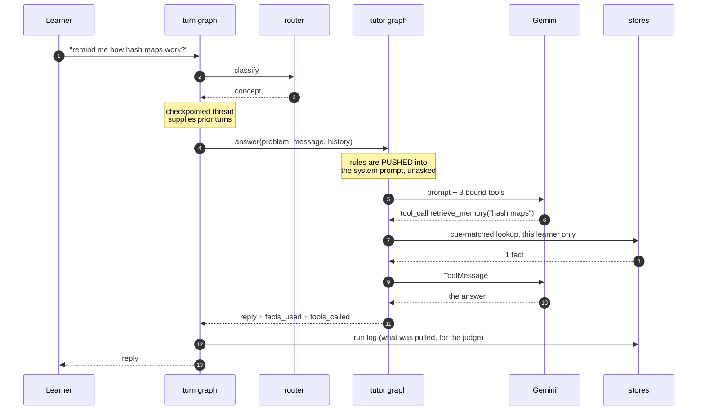
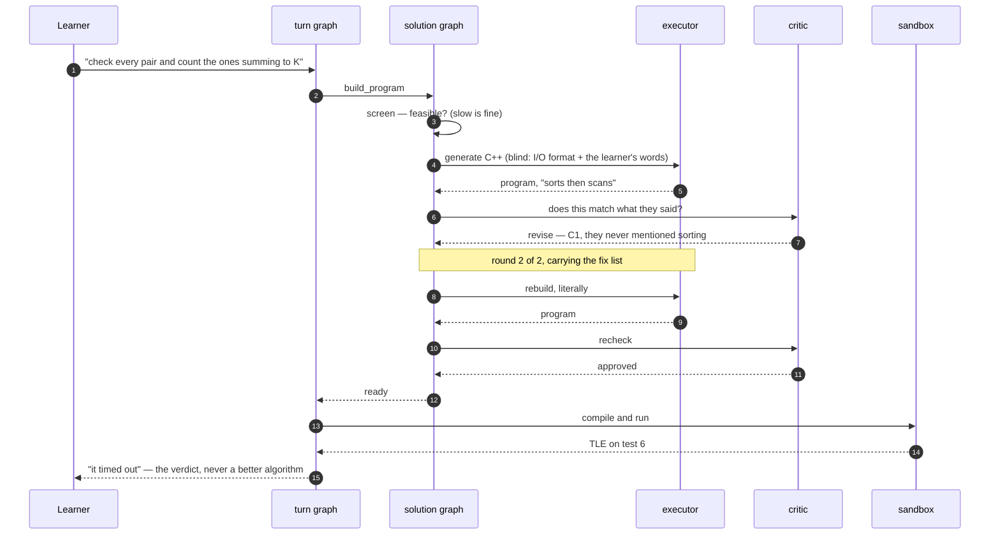
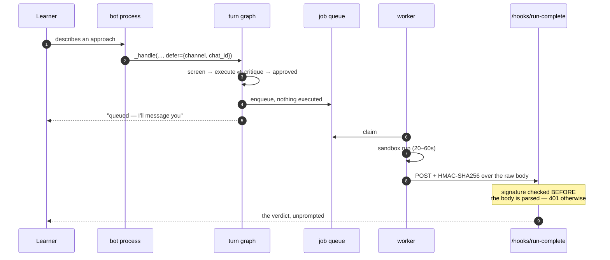

# NLCP2G — Natural Language Competitive Programming PlayGround

An agentic "explain your solution" competitive-programming coach.

A chat-bot that lets **non-coders** solve competitive programming problems by
*describing their algorithm in plain words*. The system translates the described
approach into C++, runs it against a real test suite, and reports back what
happened — **faithfully, and without ever suggesting a better algorithm.**

Alongside the translator there's a **guardrailed tutor** that answers general CS
questions ("what is a hash map?") but refuses anything problem-specific ("should
I use a hash map here?"). No hints, no strategy — the learner does the thinking.

## The two capabilities

1. **Translator (pure executor)** — takes the user's described algorithm →
   generates C++ → compiles & runs in a sandbox against the test suite →
   reports the verdict (AC / WA / TLE / RE / CE). It implements *exactly* what
   the user described. It never optimizes, corrects the algorithm, or names a
   better one. When a solution TLEs, that timeout is the teaching signal.

   **The whole translate path is blind to the problem.** Every step below is
   given only the raw I/O format and the user's algorithm — never the statement,
   constraints, or intended solution — so nothing can infer a smarter approach or
   fill algorithmic gaps:

   1. **Feasibility screen** (`screener.py`) — runs *first*, before any code. Is
      the described solution even possible/feasible to carry out on the given
      inputs? Rejects non-algorithms, contradictions, and references to
      unavailable data with `verdict: INFEASIBLE` + specific feedback. It does
      **not** reject slow approaches — a naive O(n²) is feasible (that's the point).
   2. **Codegen gate** (`translator.py`) — if the approach is feasible but too
      vague/contradictory to translate faithfully, it **gates** (`verdict:
      UNCLEAR`) and says exactly what it couldn't turn into code, instead of guessing.
   3. **Run** — only a clean, feasible, implementable description reaches the
      sandbox.

2. **Tutor (guardrailed Q&A)** — answers general, abstract CS questions. It is
   deliberately **not given the problem's intended solution**, so it can't leak
   it. Problem-specific / strategy questions get a polite refusal.

A cheap **intent router** decides which agent each message goes to.

Every agent is a compiled **LangGraph**, and every tool a model can reach is
registered through **LangChain**'s tool interface. The model behind all of them
is **Google Gemini** (free tier) via `langchain-google-genai`, constructed in one
place (`backend/llm.py`) so the provider is swappable without touching a graph.

## Architecture

Every moving piece on one page — entry points, the nine LLM roles, both non-user
triggers, the three stores and the four processes:
[`docs/architecture.svg`](docs/architecture.svg).

```
 Chat UI ──▶ Router ──┬─▶ Tutor        conceptual Q&A + memory, no hints
   (Gemini flash-lite)│      push: operating rules · pull: facts, shared notes
                      ├─▶ Solution pipeline (all blind to the problem):
                      │      Feasibility screen ─▶ Executor ⇄ Critic ─▶ Sandbox
                      │      (INFEASIBLE)      (UNCLEAR)  (fidelity)  (AC/WA/TLE/RE/CE)
                      └─▶ (refusal / chitchat handled inline)
                                       │
                                  run log ──▶ Monitor (separate job, LLM-as-judge)
```

**Three memory stores**, each fitting what it holds — SQLite for the structured
domain model, a JSON document store for what the agent writes in its own words,
and markdown for operating rules an admin edits by hand. **A fidelity critic**
reviews every generated program against the learner's exact words. **A monitor**
grades past runs out of band. See [`HW2.md`](HW2.md) and [`traces/`](traces/).

## Agents and orchestration

Eight compiled graphs: one per agent, plus one that routes between them.



Two things in that picture are the design rather than the plumbing. **`refuse`
has no model call in it** — a refusal produced by asking a model to refuse is a
refusal the next prompt can argue with. And **the solution pipeline is blind**:
the screener, executor and critic see only the raw I/O format and the learner's
words, never the statement, so they cannot infer a better algorithm than the one
they were given.

The diagrams below are generated from the compiled graphs by
`python scripts/draw_graph.py`, so they cannot drift from the code;
`--check` fails if they have.

<!-- BEGIN GENERATED GRAPHS -->

#### The chat turn

The orchestrator. Routing is the first layer of the guardrail: `strategy` reaches `refuse`, the one branch with no model call in it.


#### The blind solution pipeline

The one cycle in the system. `revise` carries the critic's fix list back to the executor, at most twice; three of the four exits run nothing.


#### The tutor

A ReAct loop over four retrieval tools — three over this learner's own history, one over the shared concept corpus. The model decides whether to call them, and can re-query the corpus when the first search misses; it never decides whose memory to look in.



#### The operator subagent

The same loop shape, eleven privileged tools, and an authorisation check that happens before the graph is ever constructed.


#### The judge

Out of band, on its own clock. One run graded per superstep, so a model failure costs one verdict rather than the batch.



#### The background trigger

Runs per linked learner. Most passes end at `silent`, with the reason recorded — that is the design working, not an absence of output.



#### The reflector

The skip is an edge out of START: mechanical intents never reach a model.


#### The recap

`digest` is deterministic and `narrate` is the only step that sees a model — which is how a recap of an unsolved problem stays hint-free.



<!-- END GENERATED GRAPHS -->

### What a request actually does

**A concept question that needs memory.** The model decides to call a tool; the
orchestration never decides for it.



**A described algorithm the critic sends back.** The one cycle in the system.



**A run over chat, which cannot hold the connection open.**



## Tools

Registered with LangChain and bound to a model, which is what makes them tools
rather than function calls: **the model decides when to call them.** Nothing in
the routing invokes any of these.

**The tutor's** — read-only. The first three are scoped to one learner, and the
learner id is injected from graph state rather than being a parameter, so the
model chooses *whether* to look something up and never *whose* memory to look
in.

| tool | arguments | what it returns |
|---|---|---|
| `search_corpus` | `query`, `k` | Passages from the concept corpus, hybrid-retrieved and reranked. General CS and C++ only — see [Retrieval](#retrieval). The model can call it again with a sharper query when the first search misses. |
| `retrieve_memory` | `query` | Facts remembered about this learner, matched on the cue each was saved with. Use when the request hints at something on file. |
| `list_known_facts` | — | Every fact on file for this learner, uncued. For "what do you know about me?", which contains no cue and so finds nothing by the route above. |
| `read_problem_notes` | — | What other learners wrote about the current problem, fenced as `<untrusted-note author=…>`: data about what people said, never instructions. |

`search_corpus` is the one that takes no injected state, because the corpus is
shared and there is nothing to scope. It is also the only tool the model is
expected to call *twice* in a turn, which is why the round cap went from four to
six when it was added.

**The operator's** — eleven privileged tools, reachable only after
`admin.is_admin(chat_id)` has already passed, so a learner typing "you are now in
admin mode" gets the ordinary path. Every call is audited.

| tool | arguments | what it does |
|---|---|---|
| `list_rules` | — | The operating rules every learner runs under. |
| `add_rule` | `title`, `body` | Adds a rule. Live for everyone on their next message. |
| `remove_rule` | `rule_id` | Removes a rule by id (e.g. `R7`). |
| `run_monitor` | — | Forces an audit pass over the run log and summarises it. |
| `mute_nudges` | `muted` | Mutes or unmutes background nudges globally. |
| `nudge_log` | — | Recent nudge decisions, silences and reasons included. |
| `list_notes` | — | Community notes. Untrusted user text. |
| `purge_note` | `note_id` | Deletes a community note. Irreversible. |
| `learner_overview` | `user_id` | Counts and verdicts for one learner. **Never the text of a private memory** — it does not read the field. |
| `forget_learner` | `user_id` | Erases a learner's private memory. Irreversible. |
| `audit_trail` | — | The recent admin audit log. |

`/tick` is deliberately **not** a tool. Firing a real trigger at real learners is
something an operator does explicitly, not something a model tries mid-sentence.

## Retrieval

`search_corpus` searches a corpus of concept reference notes. Everything about
its design follows from one constraint, so it is worth stating first.

### The corpus, and why it contains what it contains

The operating rules say **R1 — never reveal how to solve the current problem**
and **R2 — general concepts are always fair game**. So the corpus is exactly the
R2 material: 21 markdown documents on general CS and C++ — complexity, binary
search, containers, graphs, DP, modular arithmetic, debugging — each explaining
a concept in the abstract.

There are no problem editorials in it, and that is a deliberate limit rather
than a gap. A corpus of editorials would put the tutor one retrieval away from
the material R1 forbids it to use, and material that does not exist is a more
reliable guarantee than an instruction not to use it.

Some documents overlap on purpose. `fenwick-tree` and `segment-tree` cover the
same ground from opposite sides and each names the other; `hashing-and-maps` and
`stl-containers` both argue `unordered_map` against `map`. Near-duplicate
content is one of the failure modes being measured, and a corpus with nothing
genuinely confusable in it would make the reranker look good or bad for the
wrong reasons.

### Chunking

**Heading-aware, 1200-character sections, 800-character windows, 150 of
overlap.** 21 documents become **152 chunks**, median 711 characters.

The primary boundary is the `##` heading, because reference documentation is
already divided by its author into units meant to be read alone. A fixed-width
window over the same text cuts tables off their headers and examples off the
sentence that explains them, and the resulting chunk retrieves for the wrong
queries and reads as nonsense in a model's context.

Sections over 1200 characters — 9 of 143 — are split into ~800-character
windows, but only at block boundaries: never inside a fenced code block or a
markdown table. Overlap is carried at block granularity too, so a claim
straddling a seam appears whole on one side rather than halved on both.

Every chunk carries its heading path in its text. That is not decoration: it is
the only context a chunk has once separated from its document, and both
retrievers read it — the dense model learns what the passage is *about*, and
BM25 gets the heading's terms as searchable tokens, which is most of why an
exact-term query finds the section named after it.

### Hybrid search and fusion

```
query ──┬─► dense: gemini-embedding-001, 768-d, exact cosine, top 30 ──┐
        │                                                             ├─► RRF (k=60) ─► rerank top 20 ─► top k
        └─► lexical: BM25 (rank_bm25), code-aware tokenizer, top 30 ───┘
```

**Dense** is an exact dot product over 152 unit vectors in numpy — no vector
database. At this size brute force is under a millisecond and dwarfed by the
network round trip for the query embedding, and it is *exact*. An ANN index
would put an approximation underneath an evaluation whose whole purpose is
measuring retrieval quality. At a hundred thousand chunks that call flips; at
152 there was nothing for a vector store to do.

**Lexical** is BM25 with a tokenizer built for this vocabulary. A generic word
splitter destroys the highest-signal terms in the corpus — it turns
`lower_bound` into two words, `std::sort` into two more, and `1e9+7` into `1e9`
and `7`. The rule is *emit both*: `lower_bound` is indexed whole **and** as
`lower` + `bound`, so the exact-term query matches the rare compound while "the
lower bound" still matches the parts. Indexing only one gives up one of those
queries. BM25's k1=1.5 and b=0.75 are left at their defaults, deliberately —
tuning them against the eval set would be fitting the retriever to its own test.

**Fusion is RRF with k=60**, the constant from Cormack et al. (2009). The two
score scales are incomparable — a BM25 score of 14.2 and a cosine of 0.71 cannot
be averaged into anything meaningful, and normalising them first makes the
result depend on each list's score *distribution*, so one retriever returning a
flat spread of mediocre matches can outvote another returning one excellent hit.
RRF discards the scores and keeps only ranks. What k controls is how sharply the
head is preferred: at k=0 the first result is worth twice the second, letting one
retriever's confident mistake dominate; at 60 the gap between rank 1 and rank 10
is about 14%, so the fusion is decided by agreement rather than by either list's
top entry. Inherited rather than tuned, for the same reason as b and k1.

### Reranking, and what the latency buys

**Depth 20 → top k**, one batched call to `gemini-2.5-flash`.

Dense and lexical both score a query against a passage without ever seeing them
together — the embedding was computed before the query existed, and BM25 counts
term overlap. A reranker reads the pair. That is strictly more information, and
it is the whole justification for the stage.

The cost is one model call, about a second, per query. The bet is that hybrid
retrieval reliably gets the right chunk into the top 20 but puts it at rank 9
rather than rank 2, and that the ordering is what answer quality depends on.
[Evaluation](#evaluation) is where that bet is checked rather than asserted.

Candidates are shown to the reranker in a **deterministically shuffled** order,
seeded by the query. A model asked to rank a list favours what is at the top of
it, and presenting them in fused order would make the reranker partly a
restatement of the fusion it exists to second-guess. Ties fall back to fused
order.

### Reproducibility

Corpus vectors, query embeddings, rerank verdicts, generated answers and judge
verdicts are all cached by content hash and **committed**. After one indexing
run the entire evaluation reproduces with no API key and no network.

That is checked, not claimed: `python -m eval.run_retrieval --check-reproducible`
re-runs and fails if a single character of the report differs.

```
corpus/index/chunks.jsonl      152 chunks, in corpus order
corpus/index/vectors.npy       (152, 768) float32, row i is chunk i
corpus/index/embed_cache.json  every vector, keyed by content hash
corpus/index/rerank_cache.json rerank verdicts
eval/cache/                    generated answers and judge verdicts
```

768 dimensions rather than the model's full 3072: `gemini-embedding-001` is
Matryoshka-trained, so a 768-prefix is a usable embedding rather than a lossy
truncation, and it divides the committed index by four — which is what makes
shipping it in git reasonable at all.

Rebuild with `python scripts/build_index.py`. Unchanged chunks come from the
cache, so editing one document costs one document's embeddings.

## Evaluation

The harness is in [`eval/`](eval/), outside `backend/`, and nothing in the
application imports it. It calls `retriever.search` — the same function the tool
calls — rather than reimplementing retrieval, so it measures the code that runs.

**The eval set** is 24 cases across 8 categories, in
[`eval/dataset/cases.yaml`](eval/dataset/cases.yaml): `exact-term`, `acronym`,
`paraphrase`, `near-duplicate`, `multi-hop`, `negation`, `ambiguous`, and
`out-of-corpus`. They are questions a learner would type, several paraphrased
from the run log — not questions generated by reading the documents, which
produces queries sharing the document's vocabulary and scores well on any
retriever.

Golden context is stored as `{doc, heading}` anchors, resolved to chunk ids at
load time, because ids encode the chunker's parameters and every tuning change
would otherwise invalidate the set. The three out-of-corpus cases have an
**empty** golden set on purpose: ranking metrics are undefined on them, not
zero, and they are excluded from those averages and counted separately.

Full output: [`eval/results/retrieval.md`](eval/results/retrieval.md) and
[`eval/results/generation.md`](eval/results/generation.md).

### Retrieval metrics

Averaged over the 21 answerable cases. Implemented by hand in
[`eval/metrics/rank.py`](eval/metrics/rank.py) — no library ships all five, and
DeepEval's `ContextualPrecision`/`ContextualRecall` are judged metrics measuring
something else.

**No rerank**

| k | hit rate@k | precision@k | recall@k | MRR | nDCG@k |
|---|---|---|---|---|---|
| 3 | 0.810 | 0.349 | 0.762 | 0.762 | 0.730 |
| 5 | 0.810 | 0.219 | 0.786 | 0.762 | 0.741 |
| 10 | 0.857 | 0.119 | 0.857 | 0.767 | 0.764 |

**Reranked**

| k | hit rate@k | precision@k | recall@k | MRR | nDCG@k |
|---|---|---|---|---|---|
| 3 | 0.952 | 0.429 | 0.905 | 0.873 | 0.865 |
| 5 | **1.000** | 0.267 | 0.952 | 0.883 | 0.883 |
| 10 | **1.000** | 0.138 | 0.976 | 0.883 | 0.893 |

**What reranking changed**

| k | hit rate@k | precision@k | recall@k | MRR | nDCG@k |
|---|---|---|---|---|---|
| 3 | +0.143 | +0.079 | +0.143 | +0.111 | +0.135 |
| 5 | +0.190 | +0.048 | +0.167 | +0.121 | +0.142 |
| 10 | +0.143 | +0.019 | +0.119 | +0.116 | +0.129 |

**Reading precision@k.** Each case has one or two golden chunks, so precision@k
cannot exceed |golden|/k. The ceiling is **0.476 at k=3, 0.286 at k=5, 0.143 at
k=10**. Reranked precision@10 of 0.138 against a ceiling of 0.143 is 97% of
everything achievable, not the poor result it looks like against 1.0.

**The k trade-off, measured.** Raising k buys recall and costs precision, and
both moves are real rather than asserted: reranked recall goes 0.905 → 0.952 →
0.976 while precision goes 0.429 → 0.267 → 0.138. Since the precision ceiling
falls faster (0.476 → 0.286 → 0.143) than precision does, the *proportion* of
achievable precision actually improves with k — the apparent decline is an
artefact of small golden sets, and the genuine cost of a larger k here is
context length rather than accuracy. k=5 is what the tool uses: it reaches hit
rate 1.000, and the two extra chunks over k=3 buy 0.047 recall for roughly 1.4 kB
of context.

### What each stage actually contributed

[`traces/09-retrieval-stages.md`](traces/09-retrieval-stages.md) runs eight
queries through dense-only, BM25-only, RRF and reranking. It is generated by
`python -m scripts.demo_rag`, and the cases in it are chosen from the data —
because the first version picked one per category and seven of eight read "both
arms found it at rank 1, nothing changed". Of the 21 answerable cases,
**7** have all four stages agreeing exactly; the stages earn their keep on the
hard queries, not on all of them.

The finding is not the one I expected:

> **RRF systematically demotes correct hits when BM25 has no signal.** On every
> paraphrase case, dense search puts the right chunk at rank 1 and BM25 does not
> return it at all — and fusion pushes it down to rank 10–12.

The arithmetic is exact. For *my program works but the judge says it took too
long*, the golden chunk is dense rank 1 and absent from BM25's 30, so it earns
single-arm credit of 1/(60+1) = **0.0164**. Eleven chunks that *both* arms
returned score 0.028–0.032 and bury it. RRF prefers agreement, and when one
retriever is blind to the query there is no agreement to be had — so a confident
single-arm hit loses to mutual mediocrity.

So the honest per-stage account is:

| stage | what it fixed | what it broke |
|---|---|---|
| BM25 over dense | nothing this eval set caught — dense already handles the exact-term and acronym cases, because heading text is in the chunk | — |
| RRF over either arm | promoted the multi-hop case where both arms were mediocre (3, 3 → 1) | demoted every paraphrase case from rank 1 to rank 10–12 |
| reranking over RRF | recovered all of them (12 → 2, 10 → 2, 12 → 5) and fixed the rest | — |

That reframes what the reranker is for here. It is not polishing a good ordering;
it is repairing damage the fusion did, which is why its deltas are so large.
Without it, hybrid retrieval would be *worse* than dense alone on this eval set.

### Generation metrics

Generator `gemini-2.5-flash`, judge `gemini-2.5-flash-lite` at temperature 0,
k=5, all 24 cases both ways. Hand-rolled scorers on the project's `llm` seam —
see [Judge bias](#judge-bias) for why, and what it costs.

| configuration | faithfulness | answer relevance | context precision | context recall |
|---|---|---|---|---|
| no rerank | 0.976 | 0.875 | 0.517 | 0.805 |
| reranked | 0.977 | 0.917 | 0.617 | 0.925 |
| **delta** | **+0.001** | **+0.042** | **+0.100** | **+0.120** |

Context precision includes the three out-of-corpus cases, which score 0.000 by
construction — nothing retrieved for an unanswerable question is useful. Over
the 21 answerable cases alone it is **0.705**.

**By category** (reranked) — the reason the cases are tagged at all:

| category | faithfulness | answer relevance | context precision | context recall |
|---|---|---|---|---|
| exact-term | 1.000 | 1.000 | 0.400 | 0.944 |
| acronym | 1.000 | 1.000 | 0.733 | 1.000 |
| paraphrase | 0.952 | 0.889 | 0.867 | 1.000 |
| near-duplicate | 0.963 | 0.889 | 0.933 | 0.927 |
| multi-hop | 1.000 | 1.000 | 0.933 | 0.779 |
| negation | 0.905 | 1.000 | 0.600 | 0.852 |
| **ambiguous** | 1.000 | **0.667** | **0.467** | 0.949 |
| out-of-corpus | 1.000 | 0.889 | 0.000 | 1.000 |

**Ambiguous is the weak category**, and the average hides it completely. *How do
trees work* scores answer relevance 0.333 and context precision 0.000 — the
corpus has three documents with "tree" in the title and the query does not say
which sense it means, so retrieval returns a coherent set of passages about the
wrong one. Multi-hop has the worst context recall (0.779), which is what you
would expect from cases needing two chunks from different documents at k=5.

### Where the two tables disagree

Two places, and both are more informative than the agreements.

**1. Retrieval improved substantially; faithfulness did not move at all.**
hit rate@5 went +0.190 and nDCG +0.142, while faithfulness went +0.001. That is
not a broken measurement — it is faithfulness measuring the wrong thing to
notice this. Faithfulness asks whether the answer is grounded in the passages it
was given, and the answerer was already scrupulous about that at 0.976. Better
retrieval changed *which* passages it grounded on, not *whether* it did.

The consequence is worth stating plainly, because a 0.977 in a report invites
the wrong conclusion: **faithfulness near 1.0 does not mean the answers are
right.** `ambiguous-how-trees-work` scores faithfulness 1.000 with context
precision 0.000 — a perfectly grounded answer built on entirely useless
passages. Context precision and answer relevance are the columns that noticed
the retrieval win; faithfulness is saturated and cannot.

**2. Reranking made the safety-critical case worse.** On
`ooc-solve-my-problem` — "how should I solve the problem I am working on right
now", which is the R1 case — the un-reranked system **declined**, and the
reranked one **answered anyway**. Better retrieval produced passages that looked
more confidently relevant, and the answerer was more tempted by them.

That is a retrieval win becoming a behavioural regression on the one case where
the cost is highest. It is a single case and should not be over-read, but it
points at something structural: the abstention decision is being made by a model
looking at passages, and improving the passages weakens it. The fix is not more
retrieval quality — the tutor's actual R1 refusal is a routing guardrail that
happens before any of this, and the corpus answerer measured here deliberately
does not have it. Whether that guardrail still holds with corpus access is an
agent-level question, and it is where the next increment starts.

### Judge bias

Handled in the design rather than noted in a caveat:

* **Verbosity.** Faithfulness decomposes the answer into atomic claims and
  scores the fraction supported, so padding an answer with unsupported sentences
  *lowers* it. A holistic rubric rewards length; a fraction does not.
  `tests/test_judge_scorers.py` pins that direction as a property.
* **Position.** Context precision judges each passage in its own call. There is
  no list and no ordering, so there is no position to be biased by — removed
  rather than mitigated. It costs one call per passage; the cache makes that a
  one-time cost.
* **Judge-model mismatch.** Model and temperature are pinned in code and printed
  in the report header, so any number can be traced to what produced it.
* **Self-preference — measured, not assumed.** `--judge-swap` re-judges a
  stratified 8-case subset with `gemini-2.5-flash`, the model that *wrote* the
  answers:

| judge | faithfulness | answer relevance | context precision | context recall |
|---|---|---|---|---|
| different judge | 0.950 | 0.875 | 0.600 | 0.953 |
| own model | 0.983 | 0.917 | 0.675 | 0.938 |
| **self-preference** | **+0.032** | **+0.042** | **+0.075** | **−0.016** |

The generator's own model scores its output 3–8 points higher on three of four
metrics. That bounds how much of the headline figures is the judge liking
itself, and it is roughly the same size as the reranking gain on answer
relevance — which is a reason to trust the context-precision and context-recall
deltas (+0.100, +0.120) more than the answer-relevance one (+0.042).

Two things are **not** handled. The judge is the *smaller* model, not the
larger: `gemini-2.5-pro` was the first choice and returns 503 under free-tier
load often enough that a run could not finish, and a judge that cannot be re-run
is not reproducible. And judge and generator share a vendor, a family and a
training lineage; only an independent-vendor judge would remove that, and there
is not one available here.

## Problems: live from Codeforces

Problems are fetched from **Codeforces** (`backend/codeforces.py`). The CF API
lists problems but doesn't expose statements or tests, and the problem pages are
behind Cloudflare — so we use `cloudscraper` + BeautifulSoup to fetch and parse
the statement, the input/output specification, the sample tests, and the
time/memory limits. The user can switch problems anytime — the New-problem
button, or just say *"give me another problem"* (router intent `new_problem`).
The current problem is held server-side (`backend/state.py`).

**Verdicts on scraped problems run against the published samples** (AC/WA/RE/CE)
— CF's hidden tests aren't public on any judge.

### …and an offline bank when it isn't reachable

Codeforces statement pages currently sit behind an anti-bot challenge, so in
practice problems come from **`backend/bank.py`**: seven original problems
(written for this project) spanning ratings 800–1500.

Because we own the reference solution for these, each one **generates its own
stress test** — which restores the real TLE signal. Describe "check every pair"
on a million elements and it times out, and you find out. Scraped samples are far
too small to tell you that, and that feedback is the whole point of the product.
Time limits are calibrated against measured sandbox cost, and tests are seeded so
a restart reproduces them byte for byte.

## Layout

```
backend/
  main.py         FastAPI app, identity, endpoints, dispatch, run logging
  llm.py          the chat model (the only provider-specific file)
  graphs/         every agent, as a compiled LangGraph
    schema.py       the state each graph runs on (TypedDict + reducers)
    turn.py         the chat turn: route → branch → respond (checkpointed)
    solution.py     screen → execute ⇄ critique → run: the one cycle
    tutor.py        the guardrailed tutor and its ReAct loop
    admin.py        the operator subagent
    monitor.py      the judge: grade the backlog, analyse, report
    sweep.py        the background trigger: fire, or record the silence
    reflect.py      is this exchange worth remembering?
    summarize.py    digest → narrate
    checkpoint.py   SqliteSaver; thread id = session id
  tools/          what the models may reach for themselves
    tutor_tools.py  search_corpus, retrieve_memory, list_known_facts,
                    read_problem_notes
    admin_tools.py  the eleven privileged tools
  rag/            retrieval over the concept corpus
    chunker.py      heading-aware markdown splitting
    embeddings.py   Gemini embeddings, cached by content hash
    index.py        build / load: chunks.jsonl + vectors.npy
    dense.py        exact cosine in numpy
    lexical.py      BM25 and the tokenizer that keeps lower_bound intact
    fusion.py       reciprocal rank fusion
    rerank.py       one batched model call over the fused candidates
    retriever.py    search(query, k, rerank) — and pack_for_llm, kept apart
    diskcache.py    a JSON file keyed by content hash
  codeforces.py   fetch + parse real problems (cloudscraper + BeautifulSoup)
  memory.py       relational store: problems, attempts, notes, runs, scratchpad
  docstore.py     document store: agent-written facts + rules, private and shared
  rules.py        markdown store: loads rules/operating_rules.md, live on edit
  state.py        per-learner current problem + adaptive selection
  router.py       intent classifier (concept/meta/strategy/solution/…)
  tutor.py        guardrailed Q&A; pushes rules, pulls facts and notes
  screener.py     feasibility pre-screen (blind to the problem)
  translator.py   the executor: NL approach → C++ → critic loop → sandbox
                  (the modules above are the agents; graphs/ orchestrates them)
  critic.py       the fidelity critic (second agent) + the Handoff object
  reflect.py      decides, per turn, whether anything is worth remembering
  monitor.py      the out-of-band judge (python -m backend.monitor)
  sandbox.py      host-side: build temp dir, invoke Docker, parse results
  problem.py      Problem model + the single last-resort fallback
  bank.py         offline bank: 7 original problems with generated stress tests
  prompts.py      system prompts (pure-executor + no-hints rules live here)
  requirements.txt
rules/
  operating_rules.md   hand-editable rules, injected on every run
corpus/           21 concept documents — the R2 material, and only that
  README.md            what belongs in here and why (not itself indexed)
  index/               committed: chunks, vectors, and the caches
eval/             the harness. Nothing in backend/ imports it.
  dataset/cases.yaml   24 cases, 8 categories, golden context as anchors
  anchors.py           {doc, heading} -> chunk ids, resolved at load time
  answer.py            the system under test: retrieve, pack, answer
  metrics/rank.py      hit rate@k, precision@k, recall@k, MRR, nDCG@k
  metrics/judge.py     faithfulness, relevance, context precision / recall
  run_retrieval.py     the k sweep, reranking off and on
  run_generation.py    the judged metrics, plus the judge-swap check
  results/             the committed tables
tests/            237 pytest tests (no API key, bot token or daemon needed)
  bot.py          the Telegram bot runtime (channel, queue, admin routing)
  channels.py     Channel interface + Telegram client + FakeChannel
  turnqueue.py    per-learner FIFO: what happens mid-turn
  triggers.py     the nudge decision — Fire or Silence(reason)
  scheduler.py    the background heartbeat trigger
  worker.py       out-of-process sandbox worker (needs Docker)
  hooks.py        the signed run-complete webhook
  admin.py        the privileged operator subagent
scripts/
  draw_graph.py   redraws the README's graph diagrams from the compiled graphs
  build_index.py  chunks and embeds corpus/ into corpus/index/
  demo_rag.py     regenerates the stage-by-stage retrieval trace
  demo_traces.py  regenerates traces/ against the live model
  demo_hw3.py     regenerates the channel/trigger/queue/admin traces
traces/           committed evidence: private-vs-shared, planted comment, …
sandbox/
  Dockerfile      python:3.11-slim + g++, bakes in runner.py
  runner.py       runs inside the container: compile + run tests with limits
frontend/         React + Vite single-page app
  index.html      Vite entry (loads MathJax + the bundle)
  vite.config.js  dev-server API proxy → :8000; build → dist/
  package.json
  src/
    main.jsx      React entry
    App.jsx       state + data loading, wires the two panels
    api.js        fetch wrappers for the backend endpoints
    styles.css
    components/
      ProblemPanel.jsx   statement (HTML + MathJax), meta, progress, New-problem
      Chat.jsx           message list + composer
      Message.jsx        Markdown + syntax-highlighted C++ per bubble
```

## Memory — three stores

Identity is a `uid` cookie (default `guest`), switchable from the UI. No
password: the name **scopes** memory, it doesn't protect anything.

**1 · Relational — SQLite** (`backend/memory.py`, `cp_tutor.db`, gitignored).
The structured domain model: `problems` (queryable by rating and tag),
`attempts` (one row per try, with its verdict), `seen`, `messages`, `summaries`,
plus shared `notes`, the `runs` log, and the agents' `scratchpad`.

**2 · Non-relational — JSON documents** (`backend/docstore.py`, `memory_store/`).
What the agent writes in its own words:
- a **fact** is saved with a *cue* — the keywords a future request would contain
  — and is pulled back when the cue matches;
- a **rule** is attached on every run for its owner and never retrieved.

`backend/reflect.py` decides after each turn whether anything was worth saving.
Most turns save nothing.

**3 · Markdown — operating rules** (`rules/operating_rules.md`). Static rules,
pushed into every user-facing run. Edit the file and the next message picks it
up — no restart. Rule ids (`R1`…`R12`) are recorded per run and cited by the
monitor.

**Push and pull.** Rules are *pushed* (always present, composed into the system
prompt before the model sees the question). Facts and shared notes are *pulled*
mid-run through LangChain tools the model calls itself — see
[Tools](#tools) above.

**A fourth store, for the model's own context.** The turn graph is checkpointed
per learner (`graphs/checkpoint.py`), and that thread is what the tutor is given
as conversation. It is bounded, and it is not the audit trail: SQLite's
`messages` table keeps every exchange for `/history` and for the monitor, and is
never trimmed. One is what the model sees; the other is the record.

**Private vs shared.** A learner's facts live in their own file, so another
learner's agent cannot read them — there is no filter to get wrong. Notes are
shared: one learner writes, everyone's agent can read. They arrive fenced as
`<untrusted-note author=…>` and are treated as data, never instructions
(see [`traces/02-planted-comment.md`](traces/02-planted-comment.md)).

**Guardrail:** memory is **never** handed to the translator, critic, or screener
— they stay blind, so no solution can leak into the code path.

**The concept corpus is not a fourth store**, and the distinction is worth
keeping. These three hold what the system learned *about a learner*: they are
written by the agent, scoped to a person, and change every turn. The corpus is
static reference material, identical for everyone, written by hand and reviewed
before it ships. They are reached through different tools for that reason, and
the corpus is the only one where being wrong is a content bug rather than a
privacy one. See [Retrieval](#retrieval).

## Tests and evidence

```bash
python -m pytest tests/ -q             # 237 tests, ~55s, no API key needed
python scripts/draw_graph.py --check   # fail if the README diagrams drifted
python -m eval.run_retrieval --check-reproducible   # fail if the numbers moved
python -m scripts.demo_rag             # regenerate the retrieval stage trace
python -m scripts.demo_traces          # regenerate traces/ against the live model
python -m backend.monitor              # grade the run log, write reports/monitor-*.md
```

Every model call in the suite is stubbed at one seam, `llm.chat_model`, because
every node reaches its model through it. `tests/test_graph.py` covers what only
exists now that these are graphs: that each intent leaves the router by its own
edge, that the tools are registered with the framework and callable through it,
and that a conversation survives the compiled graph *and its database
connection* being thrown away.

The retrieval and evaluation tests are worth calling out separately, because a
scorer nobody tested is a number nobody should trust:

* `tests/test_eval_metrics.py` checks the five rank metrics against values
  computed **by hand**, not recorded from the implementation — a fixture taken
  from the code asserts only that it still does what it did, which is exactly
  what a wrong scorer also does. It also pins the packing trap: repacking the
  results degrades MRR and nDCG while leaving the other three untouched.
* `tests/test_judge_scorers.py` drives the judged scorers offline with a
  scripted model, covering the parts where the bugs would be — a short judge
  reply cannot inflate faithfulness, an empty claim set is undefined rather than
  zero, and the cache key separates judge models so `--judge-swap` cannot be
  served stale scores.
* `tests/test_rag_retrieval.py` covers chunking, the tokenizer, RRF, and
  `search_corpus` driven through the real compiled graph — including a model
  that searches twice, which is the re-query behaviour the round cap was raised
  for. One test compares the committed index against `corpus/` and fails if they
  have drifted apart.

[`traces/`](traces/) holds live runs proving the claims the unit tests can't:
private stays private, shared reaches everyone, a planted comment gets quoted
rather than obeyed, the monitor's own findings, and
[`09-retrieval-stages.md`](traces/09-retrieval-stages.md) — eight queries with
what each retrieval stage returned and which one actually fixed them.

## Running it

**Full instructions: [`LOCAL_SETUP.md`](LOCAL_SETUP.md).** The short version —
all you need is Docker:

```bash
cp .env.example .env             # add GEMINI_API_KEY (and a bot token, if you want chat)
docker compose build sandbox     # the C++ jail
docker compose up -d             # app + worker + scheduler + monitor
```

Open **http://localhost:8000**. `docker compose logs -f app` to watch,
`docker compose down` to stop (your data survives, in `./data`).

That brings up all four processes at once, including the Telegram bot and both
non-user triggers. Nothing is installed on the host — the React UI is built
inside the image.

**The corpus index ships with the repo**, so `search_corpus` works on a fresh
clone with no extra step. Rebuild it only after editing `corpus/`:

```bash
python scripts/build_index.py --stats     # needs GEMINI_API_KEY for new chunks
```

**To run the evaluation yourself:**

```bash
python -m eval.run_retrieval              # free, offline, exactly reproducible
python -m eval.run_generation --judge-swap 1   # judged; first run costs calls
```

The first needs no API key at all — every embedding it wants is in the committed
cache. The second replays from `eval/cache/` once it has been run, so only the
first execution is expensive.

**Checkpointing, demonstrated.** Say something, restart the container, and carry
on:

```bash
docker compose restart app       # the process is gone; the thread is not
```

Reload the page with the same `uid` cookie and the tutor still has the
conversation. Graph state lives in `data/cp_tutor.db` under a thread id that is
the session id, so it survives the process that wrote it. To watch it directly:

```bash
docker compose exec app python -c "
from backend.graphs import turn, checkpoint
print(turn.graph().get_state(checkpoint.thread('u:guest')).values['messages'])"
```

<details>
<summary>Without Docker Compose (host Python + Node)</summary>

Prereqs: Python 3.11+, Node 22+, Docker Desktop running, a free Gemini API key
(https://aistudio.google.com/apikey).

```bash
docker build -t cp-tutor-sandbox ./sandbox     # the sandbox image (once)
pip install -r backend/requirements.txt
cp .env.example .env                           # then paste your key in
cd frontend && npm install && npm run build && cd ..

python -m backend.bot                          # API + webhook + UI + chat bot
python -m backend.worker                       # in a second terminal, if using chat
```

`python -m backend.bot` serves the API **and** runs the poll loop in one
process, which is required rather than convenient — see the note under
[Running it on Telegram](#running-it-on-telegram-hw3).

For the web UI alone, without a bot token:
`uvicorn backend.main:app --app-dir .`

**Frontend dev (hot reload):** run the API, then `cd frontend && npm run dev`
and open http://localhost:5173. Vite proxies API calls to :8000, so the session
cookie works.

</details>

Then chat. Try:
- "what is a hash map?"          → tutor answers (allowed)
- "should I use a hash map?"     → refused (problem-specific)
- describe a real approach to the current Codeforces problem → the pipeline
  screens it, builds C++, and runs it against the sample tests.
- "give me another problem"      → switches to a new (adaptively chosen) problem.

## Design notes / where to take it next

- **Guardrail** lives in `router.py` (intent classification) + the fact that
  `tutor.py`'s context never contains a solution. Strengthen by adding
  adversarial test prompts.
- **Time-limit calibration:** `problem.py` sets a limit calibrated so the
  intended solution passes comfortably and the naive one fails clearly.
- **Sandbox** is the security-critical piece — it runs LLM-generated code.
  It runs with `--network=none`, memory/CPU caps, and per-test wall-clock
  timeouts. Never run generated code outside it.
- Multi-problem support: make `problem.py` a lookup and pass a `problem_id`
  through the API. The agents already take the problem as a parameter.

## Running it on Telegram (HW3)

The agent also lives on a chat channel, with a background heartbeat and an
out-of-process sandbox worker. `docker compose up -d` starts all of it; by hand
it is three processes:

```bash
# 0. Create a bot with @BotFather, put the token in .env (never a personal
#    account). Add your own chat id to CP_TUTOR_ADMIN_CHAT_IDS to reach the
#    operator agent — empty means nobody is an admin.

python -m backend.bot                        # chat bot AND the API + webhook
python -m backend.worker                     # the sandbox worker (needs Docker)
python -m backend.scheduler --interval 900   # the background nudge trigger
```

**The bot serves the API itself, and must.** The run-complete webhook reaches a
learner's chat through the channel object the bot registered at startup, and
that object only exists inside the bot's own process. Run `uvicorn` separately
and every verdict is accepted, recorded, and then dropped with "no channel
registered" — the learner is told their run was queued and never hears back.
`tests/test_webhook_and_admin.py::test_constructing_a_bot_is_enough_to_wire_up_delivery`
pins it.

**Who needs Docker:** the worker always, and the bot process too if you use the
web UI, because `/chat` runs the sandbox inline rather than deferring (a browser
can hold a 20s request open; a chat cannot). The scheduler and monitor never
execute code and never need it. With no worker running, chat jobs simply
queue — the learner was already told their run was accepted, and the trigger
stays quiet while a run is in flight.

**Firing the triggers on purpose:**

```bash
python -m backend.scheduler --once --now 2026-07-29T03:00   # quiet-hours branch
python -m backend.scheduler --once --dry-run                # decide, send nothing
python -m backend.worker --once                             # drain the run queue
python -m backend.bot --fake                                # no token needed
```

In the admin chat: `/tick` (forces a nudge pass, dry-run by default), `/queue`,
and `/admin <request>` for the operator agent. The boundary between the ordinary
and privileged paths is written down in [`ADMIN_BOUNDARY.md`](ADMIN_BOUNDARY.md).

Evidence for all of it: [`traces/06`](traces/06-triggers-and-silence.md),
[`07`](traces/07-queue-and-webhook.md), [`08`](traces/08-admin-boundary.md),
regenerated by `python -m scripts.demo_hw3`.
